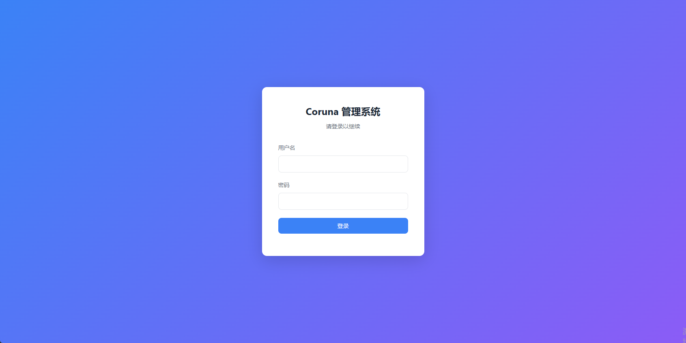
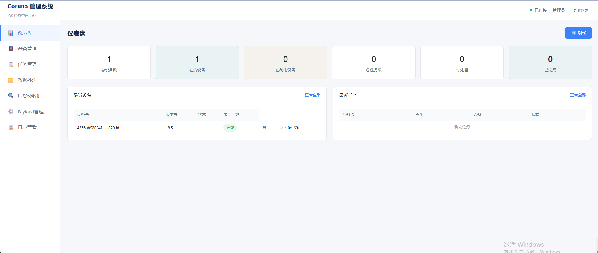
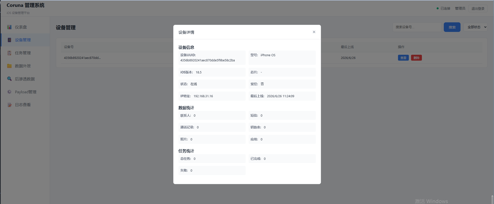

# Coruna iOS Exploit Toolkit

> ⚠️ **DISCLAIMER**: This project is for authorized security research and educational purposes only. Unauthorized use may violate laws. Please ensure use in a legal environment. The author is not responsible for any misuse.

🌐 English Version | [中文版本](README_CN.md)

---

## Project Overview

Coruna is a complete iOS malicious attack toolkit, captured from real attacks and fully decrypted and restored. This toolkit contains a complete 0-day attack chain that enables remote code execution, privilege escalation, and data theft from Web to iOS devices.

### Source Information

| Attribute | Description |
|-----------|-------------|
| Source | Captured from malicious website `sadjd.mijieqi.cn` |
| Threat Level | Complete iOS 0-day attack chain (RCE + Privilege Escalation + Data Theft) |
| C2 Status | Closed (no actual harm) |
| Purpose | Security research, education, vulnerability analysis |

---

## Technical Architecture

The attack chain consists of three main stages, coordinated from the `group.html` entry page:

```
group.html  ← Entry page
    ↓
1️⃣ Stage 1 (WebKit Exploit)
   - jacurutu    → iOS 15.2-15.5
   - bluebird    → iOS 15.6-16.1.2
   - terrorbird  → iOS 16.2-16.5.1
   - cassowary   → iOS 16.6-17.2.1
   ↓ Gain WASM R/W primitives
2️⃣ Stage 2 (PAC Bypass)
   - breezy15 / seedbell / seedbell_pre
   ↓ Bypass pointer authentication
3️⃣ Stage 3 (Sandbox Escape + Payload)
   - VariantA / VariantB
   ↓ Load malicious dylib
4️⃣ Data Theft
   - Keychain, WiFi passwords, iCloud files, etc.
```

---

## Supported iOS Versions

| iOS Version | Stage 1 | Stage 2 | Stage 3 |
|-------------|---------|---------|---------|
| 13.0-14.x | buffout | breezy | VariantA/B |
| 15.0-15.1.1 | buffout | breezy15 | VariantA/B |
| 15.2-15.5 | jacurutu | breezy15 | VariantB |
| 15.6-16.1.2 | bluebird | breezy15 | VariantB |
| 16.2-16.5.1 | terrorbird | seedbell | VariantB |
| 16.3-16.5.1 | terrorbird | seedbell | VariantB |
| 16.6-16.7.12 | cassowary | seedbell | VariantB |
| 17.0-17.2.1 | cassowary | seedbell_pre + seedbell_17 | VariantB |

### iOS 18+ Support

For complete iOS 18.4-18.7 support, please visit our professional version:

👉 [DarkSword-Pro](https://github.com/adoemwanmei/DarkSword-Pro)

---

## Directory Structure

```
Coruna/
├── group.html                 # Main entry (attack page)
├── platform_module.js         # Platform detection + Key derivation
├── utility_module.js          # Crypto utilities, Int64, LZW decompression
├── Stage1_*.js                # WebKit exploits (4 versions)
├── Stage2_*.js                # PAC bypass (5 versions)
├── Stage3_VariantB.js         # Sandbox escape + Payload builder
├── downloaded/                # Obfuscated encrypted payloads (17 files)
├── extracted/                 # Extracted binary files
├── payloads/                  # Decrypted Mach-O dylibs
│   ├── bootstrap.dylib        # Bootstrap loader
│   ├── manifest.json          # Payload manifest
│   └── <hash>/               # 19 payloads for different iOS versions
│       ├── entry0_type0x08.dylib  # Main implant (powerd)
│       ├── entry1_type0x09.dylib  # Kernel exploit
│       ├── entry2_type0x0f.dylib  # Persistence module
│       └── ...
├── other/                     # Additional resources and backup versions
├── backend/                   # C2 backend management system
│   ├── main.py               # FastAPI main application
│   ├── api/                  # API routes
│   └── ...
├── frontend/                  # Management panel frontend
├── SpringBoardTweak/          # iOS SpringBoard Tweak example (test alert)
├── start.sh                   # Linux/Mac startup script
├── start.bat                  # Windows startup script
├── ANALYSIS.md               # Encryption mechanism analysis
├── DEPLOYMENT.md             # Deployment guide
├── test_system.py            # System test script
└── coruna_c2.db              # SQLite database
```

---

## Encryption Mechanism

Payloads use multi-layer encryption:

```
[Original payload]
    ↓ ChaCha20 (per-file unique key, nonce=0)
    ↓ LZMA/XZ compression
    ↓ F00DBEEF container format
[Mach-O dylib] (arm64/arm64e)
```

**Key Findings**:
- ChaCha20 keys are derived from `group.html`
- Each iOS version has its own unique key
- Supports iOS 13-17 (arm64 and arm64e)

For detailed analysis, see [ANALYSIS.md](ANALYSIS.md).

---

## Data Theft Types

| Category | Examples |
|----------|----------|
| Communication | SMS, Contacts, Call logs |
| Credentials | WiFi passwords, Keychain, Keybag |
| Browser | Safari history, Bookmarks, Cookies |
| Location | Location history, Location service cache |
| Personal | Notes, Calendar, Health data, Photos |
| Device | IMEI, Serial number, Configuration profiles |
| Cryptocurrency | Wallet app detection (Ledger, Coinbase, Metamask, etc.) |

---

## Quick Start

### Method 1: Pure Static Web Server

```bash
cd Coruna
python -m http.server 8080
```

Then visit `http://IP:8080/group.html` in iOS Safari.

### Method 2: Complete C2 Management System

**Environment Requirements**:
- Python 3.8+
- SQLite3
- Modern browser

**Startup Steps**:

Windows:
```bash
start.bat
```

Linux/Mac:
```bash
chmod +x start.sh
./start.sh
```

**Access Management Panel**:
- Address: `http://localhost:8782`
- Default username: `admin`
- Default password: `admin123`

> ⚠️ **Important**: Change the default password after first use!

---

## Screenshots







---

## Deployment

> 🌐 [中文部署文档](DEPLOYMENT_CN.md)

See [DEPLOYMENT.md](DEPLOYMENT.md) for detailed deployment steps, including:
- Nginx/Apache configuration
- HTTPS configuration
- Firewall settings
- Security recommendations

---

## Technical Analysis

### Payload Type Description

| Type | Description | Typical Size |
|------|-------------|-------------|
| 0x08 | Main implant dylib (targets `powerd`, HTTP C2) | ~196-228 KB |
| 0x09 | Kernel/sandbox escape dylib (privilege escalation) | ~230-334 KB |
| 0x0f | Persistence dylib (hooks `launchd`, `powerd`) | ~191-192 KB |
| 0x0a | Additional exploit/persistence module (newer iOS variants) | ~50-68 KB |
| 0x05 | Data blob (kernel offsets/gadgets) | ~24 KB |
| 0x07 | Small config/metadata blobs | 44 or 468 bytes |

### C2 Address Modification

C2 addresses are stored in the Mach-O dylib binary data, located at `payloads/*/entry0_type0x08.dylib`. Modification steps:

1. Search for strings in the Mach-O dylib
2. Modify with a hex editor
3. Re-sign (iOS requires code signing)

For detailed instructions, see [1.Coruna 项目完整分析.md](1.Coruna%20项目完整分析.md).

---

## Security Research Value

| Aspect | Description |
|--------|-------------|
| Completeness | ✅ Complete attack chain (Web→RCE→Privilege Escalation→Data Theft) |
| Usability | ✅ C2 closed, cannot be used in practice |
| Research Value | ✅ Extremely high (contains real iOS exploits and kernel vulnerabilities) |
| Legal Risk | ⚠️ For authorized research only, unauthorized use prohibited |

---

## File Description

| File | Description |
|------|-------------|
| `group.html` | Attack entry page, coordinates the entire attack chain |
| `platform_module.js` | Platform detection and key derivation logic |
| `utility_module.js` | Crypto utilities, Int64 operations, LZW decompression |
| `Stage1_*.js` | WebKit exploits (different iOS versions) |
| `Stage2_*.js` | PAC pointer authentication bypass |
| `Stage3_VariantB.js` | Sandbox escape and payload builder |
| `bootstrap.dylib` | Bootstrap loader, validates and loads other dylibs |
| `payloads/manifest.json` | Payload manifest file |
| `test_system.py` | System test script |
| `SpringBoardTweak/` | iOS SpringBoard Tweak example, for testing jailbreak environment |

---

## Notes

1. **Research Only**: This tool is for security research and educational purposes only
2. **Legal Authorization**: Obtain explicit written authorization before use
3. **C2 Closed**: Original C2 server is closed, tool cannot be used in practice
4. **Data Security**: Do not test on production environments or real devices
5. **Legal Risk**: Unauthorized use may violate computer-related laws and regulations

---

## Related Documents

- [ANALYSIS.md](ANALYSIS.md) - Payload decryption mechanism detailed analysis
- [DEPLOYMENT.md](DEPLOYMENT.md) - Deployment guide
- [1.Coruna 项目完整分析.md](1.Coruna%20项目完整分析.md) - Complete project analysis report
- [backend/README.md](backend/README.md) - C2 backend management system documentation

---

## Contact

Get full project and technical support:

- **Telegram**: [https://t.me/Jeequan](https://t.me/Jeequan)
- **Technical Support**: 5000U (not free)

---

**Last Updated**: 2026-06-26  
**Version**: 1.0